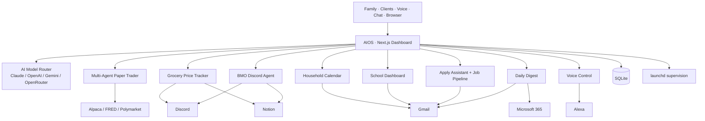

# Hi, I'm Mike Cutillo

**AI systems builder. Enterprise implementation leader. The person organizations call when they need new technology to actually get used.**

I've spent my career at exactly one intersection: cutting-edge technology and the humans who need to use it. I learn things first, build with them, and then help organizations adopt them. That pattern runs from my years as a Microsoft Learning Specialist and three-time Demo Cup Champion, through co-founding an EdTech company from inside a working K-8 school, to independently building and deploying AI workflow platforms for clients today.

I don't just advise on AI — I ship it. The repos here are tools I built for real use, currently running in production. Flagship systems like **BMO** (our family's live-in Discord AI) and **AIOS** (a personal AI operating system) surface here as overview repos because the running code is wired into private household infrastructure.

---

## Currently Building

I'm developing a **personal AI operating system** — a unified platform that orchestrates family life, job search, content creation, cloud storage, home infrastructure, and finances through a single local dashboard. The system spans **34+ active projects** across **7 responsibility areas**, all tracked through a structured PARA methodology in Notion.

Active work right now:
- **BMO — Family AI Companion** — A 24/7 Discord bot for my household, running on a capability registry I can extend without redeploying. Kids can DM it for curfew checks, Pulse surveys, homework reminders, and more.
- **[Multi-Agent Paper Trader](https://github.com/mikecutillo/multi-agent-paper-trader)** — Python paper-trading bot. Phases 0–5 are rule-based signal agents; Phase 6 hands the final decision to a Claude arbiter. Safe sandbox, no real orders.
- **[AIOS](https://github.com/mikecutillo/aios) — Personal AI Operating System** — Next.js dashboard with modules for job pipeline, cloud storage, household calendar, grocery deals, school tracking, content publishing, and BMO ops
- **[One-Click Job Apply](https://github.com/mikecutillo/aios-apply-assistant)** — Playwright automation that fills applications from an AI-powered answer bank
- **[Multi-Provider AI Router](https://github.com/mikecutillo/ai-model-router)** — Intelligent waterfall across Claude, OpenAI, Gemini, and OpenRouter with cost-aware fallback
- **[Grocery Price Tracker](https://github.com/mikecutillo/grocery-price-tracker)** — Python pipeline that scrapes weekly flyers across chains, normalizes SKUs in SQLite, and alerts on meaningful deals

---

## System Architecture

---

## What I Build

### [BMO — Family AI Companion (Discord)](https://github.com/mikecutillo/bmo-discord-agent) 🌟
My favorite thing I have ever built. BMO is a 24/7 TypeScript + Discord.js bot that lives in the Cutillo family server and acts as a shared household brain. Everything is driven by a **20-capability registry** with six executor types (scheduled-summary, intent-response, state-watcher, survey, external-api, static-response), so I can add new behaviors by writing a Notion row — no redeploy. Config spans **6 Notion databases** (Capabilities, Channels, People, Personality, Pulse Questions, Incidents), giving me a "One Voice" brand across **21 channels** for the whole family. Runs under `launchd` with auto-restart supervision, integrates Anthropic Claude for natural replies, and exposes a `/bmo` control surface. Kids interact with numbered-option replies for curfew, Pulse check-ins, and chore reminders. *(overview repo — running code is private because it is wired into family infrastructure)*

### [Multi-Agent Paper Trader](https://github.com/mikecutillo/multi-agent-paper-trader) — AI-Augmented Paper Trading
Personal paper-trading bot written in Python. Phases 0–5 apply rule-based signal generation, position sizing, and risk checks; **Phase 6 hands the final trade decision to a Claude arbiter** with full market context and journaled reasoning. Zero real orders — purely a sandbox for iterating on multi-agent decision patterns before any capital ever enters the loop.

### [AIOS](https://github.com/mikecutillo/aios) — Personal AI Operating System
Full-stack Next.js platform that orchestrates job tracking, content pipelines, cloud storage monitoring, and AI-assisted workflows across Claude, OpenAI, and Gemini. Integrates a multi-provider model router, kanban job pipeline, answer bank, Playwright-based automation worker, and the live ops surface for BMO — all inside AIOS, from a single local dashboard. *(overview repo — AIOS itself runs on my own infrastructure; the component pieces ship as public repos below.)*

### [Apply Assistant](https://github.com/mikecutillo/aios-apply-assistant) — Chrome Extension
Chrome MV3 extension that bridges the browser and the local pipeline. One click on any job posting scrapes structured metadata (JSON-LD, OG tags, DOM heuristics) and adds it to the AIOS kanban. On application forms (LinkedIn, Workday, Greenhouse, Lever, Ashby, iCIMS), it scans every labeled input, resolves answers from the shared AI answer bank, and fills using React-safe native setters. Every unanswered question is logged and becomes a permanent answer once resolved — the system learns.

### [Job Search Automation](https://github.com/mikecutillo/linkedin-job-automation)
Playwright + Selenium automation using Chrome remote debugging session reuse — Easy Apply workflows, fit analysis via 4-lane Claude tailor pipeline, custom resume generation, and zero-interaction apply for known-answer forms.

### [Google AI Toolkit](https://github.com/mikecutillo/google-ai-toolkit)
Python tools for Gmail and Google Drive management across multiple accounts — AI-assisted email analysis powered by Claude, OAuth 2.0 auth, cleanup automation, and Plotly analytics dashboards.

### [Microsoft 365 AI Toolkit](https://github.com/mikecutillo/m365-ai-toolkit)
Streamlit dashboard with Microsoft MSAL authentication for mailbox analysis, OneDrive management, and unified M365 ecosystem visibility.

### [AI Model Router](https://github.com/mikecutillo/ai-model-router)
Multi-provider LLM router with intelligent waterfall fallback (Claude → OpenAI → Gemini → OpenRouter). Built for real operational use — task management, content pipelines, cloud monitoring — deployed for clients with their own tools, identity systems, and workflows.

---

## Selected Career Work

| Role | Highlights |
|---|---|
| **Microsoft — Learning Specialist, 3× Demo Cup Champion** | Enterprise training and product evangelism for new Microsoft technology. Built adoption curricula delivered to global audiences; three-time internal Demo Cup winner for technical storytelling. |
| **EdTech Co-Founder (K-8 school)** | Co-founded an educational technology company from inside a working K-8 school. Shipped product used daily by real students and teachers. |
| **Independent AI Implementation — current** | Building and deploying AI workflow platforms for clients. Deliverables span multi-provider model routing, answer banks and auto-apply pipelines, cloud/data consolidation, and AI-assisted content + social publishing systems with persona management and multi-channel automation — each tailored to the client's identity and toolset. |

---

## More from the AIOS Portfolio

Companion overview repos — public docs, private code. Each links to a deeper README explaining the architecture:

| Project | What it does |
|---|---|
| **[AIOS](https://github.com/mikecutillo/aios)** | The Next.js shell everything else lives inside — 16+ unified modules on a Mac Mini |
| **[BMO — Family AI Companion](https://github.com/mikecutillo/bmo-discord-agent)** | 24/7 Discord bot with a 20-capability registry (Notion-configured, no redeploy) |
| **[Grocery Price Tracker](https://github.com/mikecutillo/grocery-price-tracker)** | Scrapes weekly flyers, normalizes SKUs, alerts on deals |
| **[PowerSchool Scraper](https://github.com/mikecutillo/powerschool-scraper)** | K-12 gradebook extractor with rules-engine alerts |
| **[Classroom Scraper](https://github.com/mikecutillo/classroom-scraper)** | Google Classroom aggregator across students + courses |
| **[Household Voice Control](https://github.com/mikecutillo/household-voice-control)** | Alexa → AIOS webhook bridge with Claude-powered intent parsing |
| **[Household Digest](https://github.com/mikecutillo/household-digest)** | AI-composed daily briefing across Gmail, Calendar, M365, news |

## By the Numbers

| | |
|---|---|
| **Active Projects** | 50+ across family infra, AI, career, content, home ops, and finance |
| **Flagship System** | BMO — a family-wide Discord AI with 20 extensible capabilities |
| **Technologies** | 24+ integrated services and APIs in production |
| **AI Providers** | Claude, OpenAI, Gemini, OpenRouter — multi-provider with fallback |
| **Cloud Integrations** | Gmail, Google Drive, Microsoft Graph, iCloud, Discord, Buffer, Notion |
| **Automation** | Playwright, Selenium, Chrome Extensions, launchd, cron pipelines |

---

## Tech Stack

---

## Connect

📍 Holmdel, NJ · Open to AI implementation, solutions architecture, and EdTech roles
