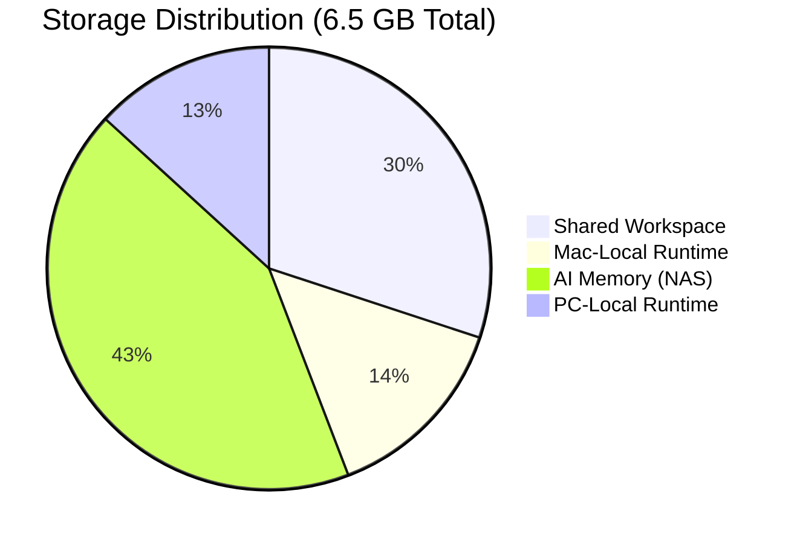
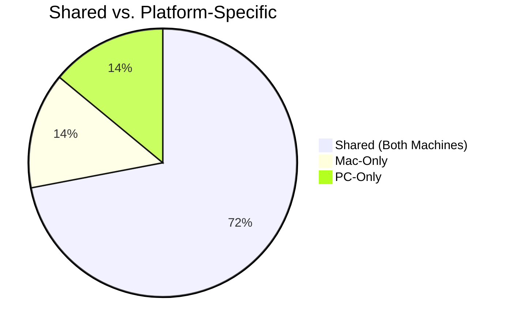
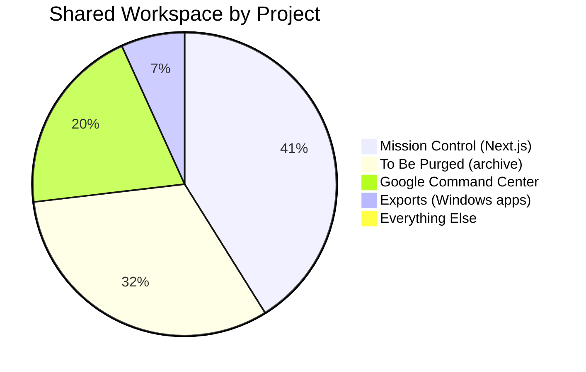
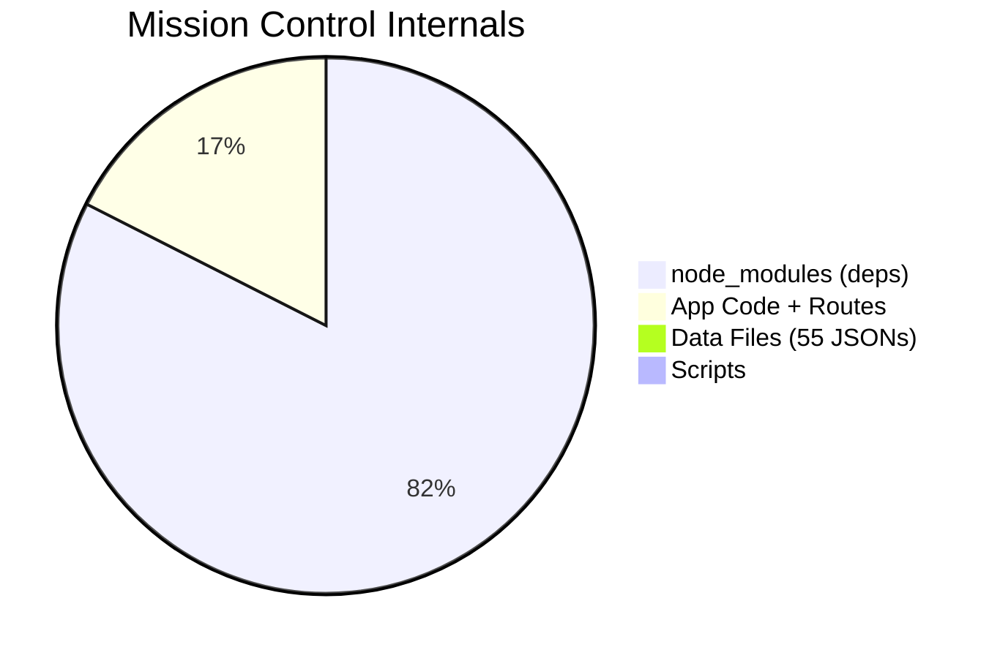
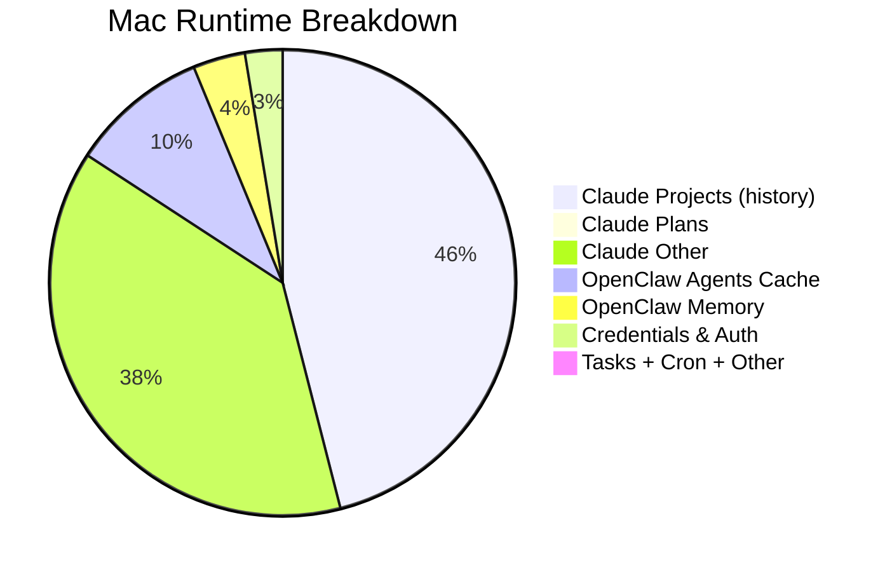
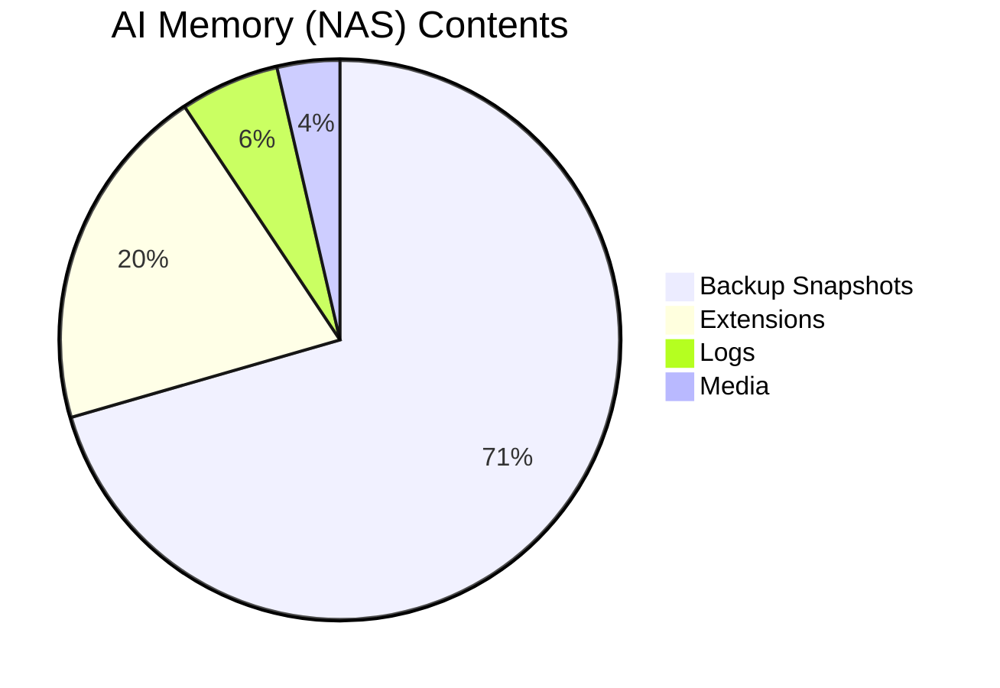
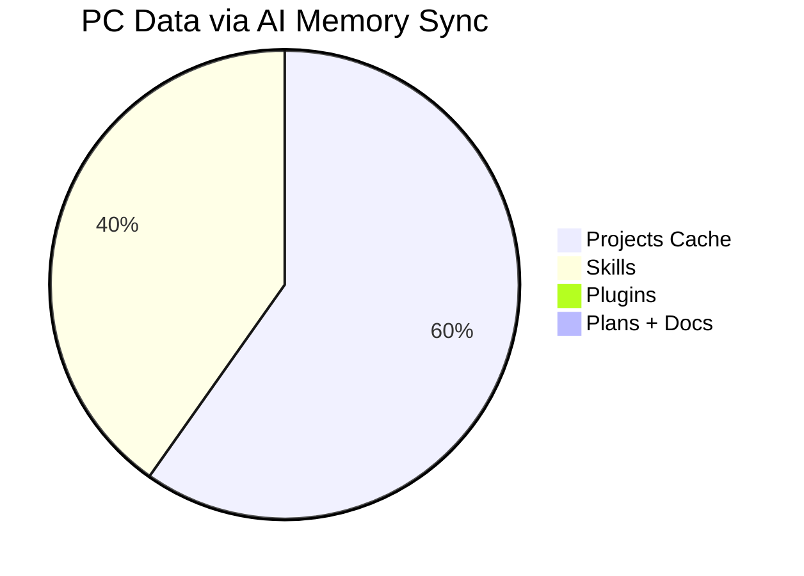
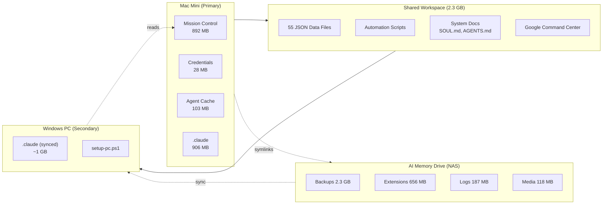

# OpenClaw Data Architecture

> How the Cutillo AI OS distributes data across Mac, PC, and shared storage.
> Generated 2026-04-12.

---

## The Big Picture

The system runs across **four storage tiers**: a shared sync layer both machines read from, Mac-local runtime state, PC-local runtime state, and a NAS-backed "AI Memory" drive for long-term storage.

| Tier | Size | What Lives Here |
|------|------|-----------------|
| **Shared Workspace** | 2.3 GB | Projects, apps, scripts, data, config docs — the cross-platform source of truth |
| **Mac-Local Runtime** | ~1.1 GB | Credentials, agent cache, conversation history, task state, cron jobs |
| **AI Memory (NAS)** | ~3.3 GB | Backups, extensions, logs, media — offloaded from Mac SSD |
| **PC-Local Runtime** | ~1.0 GB | Skills, plans, projects cache, plugins — synced subset for Windows Claude |

---

## Shared vs. Platform-Specific

**72% of the active working data is shared.** Both machines see the same mission-control app, the same scripts, the same data files, and the same docs. Platform-specific data is mostly runtime caches and credentials.

---

## Shared Workspace Breakdown (2.3 GB)

| Directory | Size | Purpose |
|-----------|------|---------|
| `mission-control/` | 892 MB | The dashboard — Next.js app, 55 JSON data files, API routes |
| `To Be Purged/` | 694 MB | Archived data queued for cleanup |
| `google-command-center/` | 436 MB | Gmail automation, Streamlit UI, Google API |
| `exports/` | 147 MB | Windows desktop app builds (Feather) |
| `resumes/` | 812 KB | 4 resume variants + tailored versions |
| `memory/` | 492 KB | Daily session logs, shared memory index |
| `scripts/` | 208 KB | Automation (gmail-wipe, digest-engine, notion-sync) |
| `docs/` | 236 KB | Architecture docs, plans, project briefs |
| `control-center/` | 2.0 MB | Legacy Node.js control UI |
| Other | ~1 MB | photo-library, iba, reports, tools |

---

## Mission Control — The Heart (892 MB)

Mission Control is 82% dependencies. The actual app — API routes, pages, components, and 55 JSON data files powering everything from job pipeline to family calendar — is only **162 MB**.

---

## Mac-Local Runtime (~1.1 GB)

| Component | Size | Shared? |
|-----------|------|---------|
| `.claude/projects/` | 495 MB | No — conversation transcripts |
| `.claude/` (plans, settings) | 411 MB | Plans sync to PC via drive |
| `.openclaw/agents/` | 103 MB | No — cached agent interactions |
| `.openclaw/memory/` | 39 MB | No — local memory (separate from shared) |
| `.openclaw/credentials/` | 28 MB | No — API keys, OAuth tokens, auth state |
| Tasks, cron, sandboxes, flows | 6 MB | No — ephemeral runtime state |

---

## AI Memory Drive — NAS Offload (~3.3 GB)

Four directories symlinked from `~/.openclaw/` to `/Volumes/AI Memory/`:

| Directory | Size | Purpose |
|-----------|------|---------|
| `backup-snapshots/` | 2.3 GB | Full workspace clones for rollback |
| `extensions/` | 656 MB | OpenClaw plugin extensions |
| `logs/` | 187 MB | Historical agent + system logs |
| `media/` | 118 MB | Generated media assets |

This freed **~5 GB** from Mac SSD (80 GB -> 85 GB free after migration).

---

## PC Receives (~1 GB synced subset)

The PC runs Claude Code against the shared workspace over the network. Its local `.claude/` gets:

| Component | Size | Source |
|-----------|------|--------|
| Projects cache | 605 MB | Synced from AI Memory drive |
| Skills | 407 MB | Synced from AI Memory drive |
| Plugins | 3.1 MB | Synced from AI Memory drive |
| Plans + workspace docs | ~1 MB | `SOUL.md`, `AGENTS.md`, `PC-BRIEFING.md` |

The PC reads Mission Control at `http://192.168.1.74:3333` — no local copy of the app needed.

---

## Data Flow

---

## Key Takeaway

The system is designed as a **Mac-primary, PC-secondary** architecture where:

- **72%** of working data is shared and platform-agnostic
- **Credentials and auth never leave the Mac** — the PC authenticates independently
- **Long-term storage offloads to NAS** — keeping the Mac SSD lean
- **The PC is a lightweight execution node** — it runs Claude Code against the shared workspace over the network, needing only ~1 GB of local cache
- **Mission Control is the single UI** — served from Mac, accessed by both machines at `localhost:3333` (Mac) or `192.168.1.74:3333` (PC)
